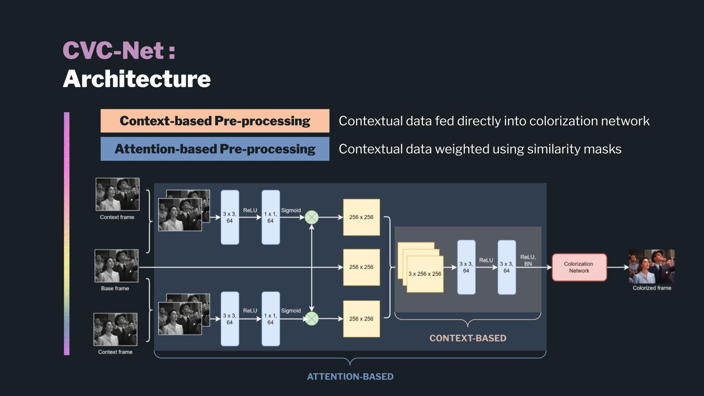

# Context-based video colorization 
Video Colorization Network with a modified CIC Architecture for temporal coherency

Youtube video link: https://youtu.be/UFeQ-lUwwL8

Team project done as part of the [Deep Learning course (11-785)](https://deeplearning.cs.cmu.edu/S22/index.html) at Carnegie Mellon University (Spring 2022)
